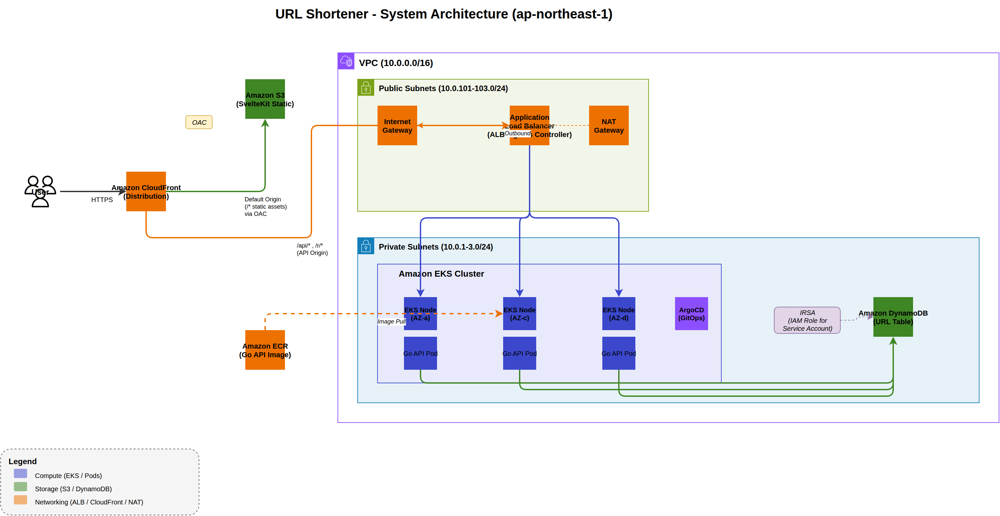
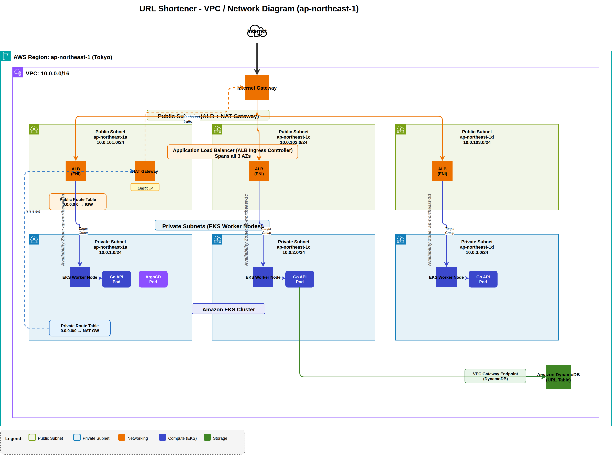
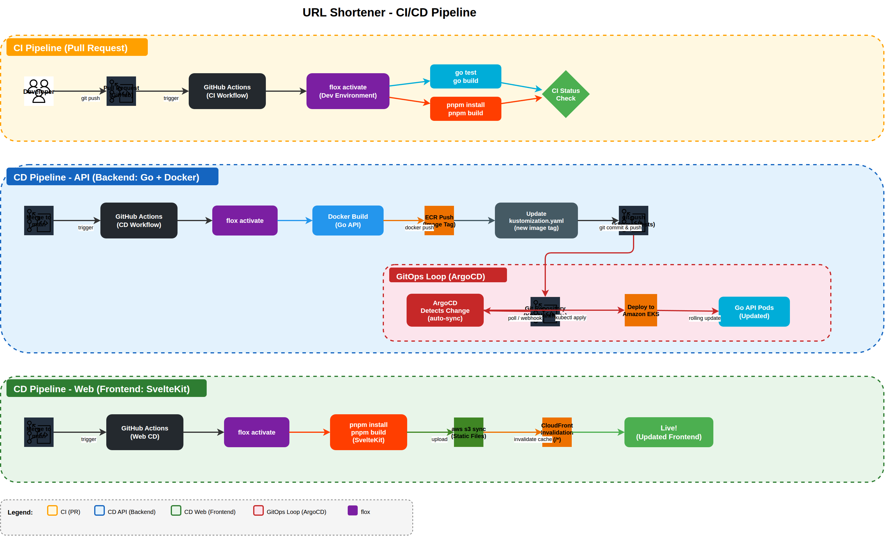

# URL Shortener

URLを短くしてクリック数も見れるやつ。AWS使って色々やってみたくて作った。

## 構成図



<details>
<summary>ネットワーク構成</summary>


</details>

<details>
<summary>CI/CDパイプライン</summary>


</details>

> draw.io のファイルは [docs/](docs/) にあります

## 使った技術

| | |
|---|---|
| フロント | SvelteKit 2, Svelte 5, Tailwind CSS v4 |
| バックエンド | Go (標準ライブラリ + AWS SDK v2) |
| DB | DynamoDB |
| コンテナ | Docker, ECR, EKS |
| IaC | Terraform |
| CD | ArgoCD (GitOps) |
| CI | GitHub Actions, flox |
| 配信 | CloudFront (S3とALBをまとめて同一ドメインで出してる) |

## ディレクトリ構成

```
url-shortener/
├── api/          # GoのAPI
├── web/          # SvelteKitのフロント
├── infra/        # Terraform
├── manifests/    # K8sマニフェスト + ArgoCD
├── docs/         # 構成図 (draw.io)
└── .github/      # GitHub Actionsのワークフロー
```

## APIの仕様

| Method | Path | 何するか |
|--------|------|---------|
| POST | `/api/shorten` | URLを短縮 |
| GET | `/api/urls` | 一覧取得 |
| GET | `/api/urls/{code}` | 1件取得 |
| DELETE | `/api/urls/{code}` | 削除 |
| GET | `/r/{code}` | 元のURLにリダイレクト |
| GET | `/health` | ヘルスチェック |

## ローカルで動かす

開発ツールは全部floxで管理してるので、まずfloxを入れる。

```bash
nix profile install --accept-flake-config github:flox/flox
```

あとはactivateすればgo, terraform, kubectl, pnpm等が全部使える。

```bash
flox activate
cd api && go run . &                # APIが :8080 で起動
cd web && pnpm install && pnpm dev  # フロントが :5173 で起動
```

Viteのプロキシ設定で `/api/*` と `/r/*` がGoのAPIに流れるようにしてある。

## AWSにデプロイ

```bash
cd infra && terraform apply   # EKS, DynamoDB, ECR, S3, CloudFront 等を作成
```

全手順は [CLAUDE.md](CLAUDE.md) に書いてある。

使い終わったら忘れずに壊す。

```bash
cd infra && terraform destroy
```

## コストについて

EKSはコントロールプレーンだけで月$73かかるので、常時稼働だと月$150くらいになる。
普段は `terraform destroy` しておいて、デモのときだけ `apply` する運用にしてる。

## セキュリティ面

- Go側でIPあたり10リクエスト/分のレート制限をかけてる
- DynamoDBはプロビジョニングモードにして、読み2/秒・書き1/秒に抑えてる
- S3はプライベートバケットで、CloudFrontのOAC経由でしかアクセスできない
- PodからDynamoDBへのアクセスはIRSAで最小権限にしてる
