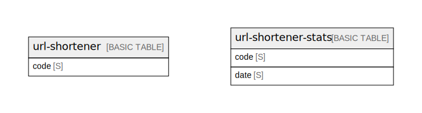

# Amazon DynamoDB (ap-northeast-1)

## Tables

| Name                                          | Attributes | Comment                                                                                                                                                                    | Type        |
| --------------------------------------------- | ---------- | -------------------------------------------------------------------------------------------------------------------------------------------------------------------------- | ----------- |
| [url-shortener](url-shortener.md)             | 1          | URL shortening codes. PK only. Production billing: PROVISIONED (read=2, write=1). Local/CI: PAY_PER_REQUEST. See ../entities.md for full attribute definitions.  | BASIC TABLE |
| [url-shortener-stats](url-shortener-stats.md) | 2          | Daily click stats per URL. PAY_PER_REQUEST. Composite key for time-series queries via begins_with on date. See ../entities.md and ../access-patterns.md.         | BASIC TABLE |

## Relations

---

> Generated by [tbls](https://github.com/k1LoW/tbls)
