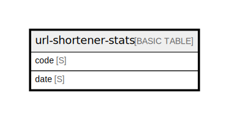

# url-shortener-stats

## Description

Daily click stats per URL. PAY_PER_REQUEST. Composite key for time-series queries via begins_with on date.  
See ../entities.md and ../access-patterns.md.  

## Attributes

| Name | Type | Default | Nullable | Children | Parents | Comment                                                               |
| ---- | ---- | ------- | -------- | -------- | ------- | --------------------------------------------------------------------- |
| code | S    |         | false    |          |         | Partition key. References url-shortener.code (no FK in DynamoDB).     |
| date | S    |         | false    |          |         | Sort key. ISO date YYYY-MM-DD. Query with begins_with for date range. |

## Primary Key

| Name        | Type                       | Definition                                                                               |
| ----------- | -------------------------- | ---------------------------------------------------------------------------------------- |
| Primary Key | Partition key and sort key | [{ AttributeName: "code", KeyType: "HASH" } { AttributeName: "date", KeyType: "RANGE" }] |

## Relations

---

> Generated by [tbls](https://github.com/k1LoW/tbls)
