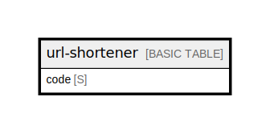

# url-shortener

## Description

URL shortening codes. PK only. Production billing: PROVISIONED (read=2, write=1).  
Local/CI: PAY_PER_REQUEST. See ../entities.md for full attribute definitions.  

## Attributes

| Name | Type | Default | Nullable | Children | Parents | Comment                                                                                      |
| ---- | ---- | ------- | -------- | -------- | ------- | -------------------------------------------------------------------------------------------- |
| code | S    |         | false    |          |         | Partition key. URL-safe short code (random or generated). Used as the public path /r/{code}. |

## Primary Key

| Name        | Type          | Definition                                   |
| ----------- | ------------- | -------------------------------------------- |
| Primary Key | Partition key | [{ AttributeName: "code", KeyType: "HASH" }] |

## Relations

---

> Generated by [tbls](https://github.com/k1LoW/tbls)
